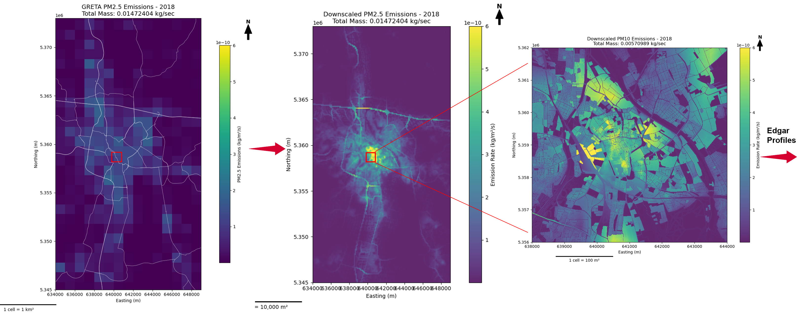

# downscale_emissions_local

## Description
This tool is aimed to downscale a gridded emission inventory using surface characteristics such as land cover types, population density and street types. The tool integrates multiple data sources and applies sector-specific downscaling approaches to create temporally-resolved emission fields suitable for urban air quality modeling. The sector specific emissions are downscaled using a similar method as used in the [UrbEm Hybrid Method to Derive High-Resolution Emissions for City-Scale Air Quality Modeling](https://www.mdpi.com/2073-4433/12/11/1404). Additionally, we included very high resolution downscaling using the spatial proxies, temporal disaggregation of emissions, NOx speciation to NO and NO2, PM speciation - fine adn coarse, effective handling of output big GeoTIFF's which has more than 60000 band limits, etc.,

  
  

## Key features:

1. Sector-specific proxy allocation (land use, population, road networks)

2. Temporal disaggregation using EDGAR temporal profiles

3. Support for multiple pollutants (PM2.5, NOx, SO2, etc.)

4. Automatic speciation of NOx to NO and NO2, if the species in the config file has nox. 

5. Speciation on PM (both PM2.5 and PM10) to EC, OC, SO4, Na, OthMin (Other Minerals) - both fine and coarse using the CAMS-REG-v6 profiles from TNO.

6. Creating dummy O3 GeoTIFF for efficient O3 simulation in PALM.

7. Output in GeoTIFF format with effective big GeoTIFF output handling for outputs with more than 60000 bands. 

## The tool consists of seven main components:

1. Configuration parser (tools.py) - Handles YAML configuration.

2. Proxy preparation (proxy_tools.py) - Processes spatial proxies.

3. Emission processing (emission_tools.py) - Core downscaling algorithms

4. The mass balance evaluation (mass_balance_tools.py) - Ensures the mass balance in the downscaled emissions wrt the Emission inventory and performs speciation of NOx and PM.

5. The Temporal disaggregation of emissions (temporal_profiles.py) - Applies the Edgar's temporal profiles to the yearly downscaled emissions for the high temporal resolution of emissions (yearly -> hourly) for the specified date. 

6. Main workflow (main.py) - Orchestrates the process.

7. The input configuration file (default_config.yaml).

## Input data
The following data is required to downscale a emission inventory using this tool.

1. Emission inventory
	* GRETA Emission inventory - point and gridded data as Geodatabase.
	* Format: ESRI Geodatabase
	* TNO Emission inventory
	* Citation: Umweltbundesamt (UBA). (n.d.). Data on emission inventory for Germany. 
2. Population density
	* GHSL - Global Human Settlement Raster with 100 m resolution.
	* Format: GeoTIFF
	* [Download](https://ghsl.jrc.ec.europa.eu/download.php?ds=pop)
3. Urban Atlas Land Cover
	* Geodatabase land cover dataset with 50 m resolution for Urban region.
	* Surface characteristic used to downscale emissions for specific sectors.
	* Format: ESRI Geodatabase
	* [Download](https://land.copernicus.eu/en/products/urban-atlas)
4. EDGAR high resolution temporal profiles
	* Temporally distribute emissions for specific sectors and country location.
	* Format: CSV files
	* [Download](https://edgar.jrc.ec.europa.eu/dataset_temp_profile)
	* Citation: Crippa, M., et al. (2020). High resolution temporal profiles in the Emissions Database for Global Atmospheric Research. Scientific Data, 7(1), 121. https://doi.org/10.1038/s41597-020-0462-2 
5. VIIRS nighttime light annual data (average radiance composite images using nighttime data from the Visible Infrared Imaging Radiometer Suite (VIIRS) Day/Night Band (DNB))
    * Downloaded from the Earth Observation Group - Payne Institute for Public Policy.
	* Format: GeoTIFF
	* [Download](https://eogdata.mines.edu/nighttime_light/)
	* Citation: C. D. Elvidge, K. Baugh, M. Zhizhin, F. C. Hsu, and T. Ghosh, “VIIRS night-time lights,” International Journal of Remote Sensing, vol. 38, pp. 5860–5879, 2017. 
	  * NOAA VIIRS night light (https://eogdata.mines.edu/nighttime_light/annual/v22/2024/VNL_npp_2024_global_vcmslcfg_v2_c202502261200.average_masked.dat.tif.gz)
6. OpenStreetMap(OSM)
	* Retrieved using the OSMnx API
7. emission_time_factors.xlsx 
    * The XLSX file that connects GRETA sectors with teh EDGAR sectors. (Save this file in the EDGAR folder together with the EDGAR temporal profiles, the file is in the repo for your reference.)
8. PM Speciation profiles from CAMS-REG-v6
    * To split the PM emission.
	* Format: Excel sheet (.xlsx)
	* Available upon request to TNO.
	* Citation: 

## Usage
* Use `downscale_greta_env.yaml` file to install all the required dependencies.
* To use this tool, one can use the default configuration file (`default_config.yaml`) as a template to provide the input parameters. The input parameters are described in the table below.
* The code must be executed by providing the name of the configuration file in the command file. For example, `python main.py -c default_config`. Please note: -c/--config: Base name of configuration file (without .yaml extension)

## Configuration file

| **Parameter** | **Description**|
| --- | --- |
| **data_settings** | |
| emiss_dir  | Path to GRETA Geodatabase or TNO files. |
| corine_dir | Path to CORINE Geodatabase. |
| popul_dir  | Path to population density raster. |
| edgar_dir  | Path to EDGAR temporal profile. |
| pm_speciation_file  | Path to PM speciation file. |
| **job_settings** | | 
| job_path | Path to simulation data. |
| job_name | Simulation name. |
| min_lon | Min. longitude of model domain. |
| max_lon | Max. longitude of model domain. |
| min_lat | Min. latitude of model domain. |
| max_lat | Max. latitude of model domain. |
| resol | Domain resolution (meters). |
| epsg_code | EPSG of domain. |
| species | List of species to be downscaled. **Hint:** GRETA requires both PM10  & PM2.5 |
| country | Country location of model domain. |
| inventory | Emission inventory used. `GRETA or TNO` |
| **temporal** | |
| apply_temporal | If Temporal disaggregation of emissions is required, then set True, if not False |
| start_date | Specify the starting date for temporal disaggregation |
| end_date | Specify the ending date for temporal disaggregation |
| country | Edgar's country code |
| profile_year | Specify the year of the emissions |
| **pm_speciation** | |
| country_code | Specify the country code |
| year | Specify the year |

## Authors and acknowledgment
Show your appreciation to those who have contributed to the project.
For details and comments, please contact:
1. Sathish Kumar Vaithiyanadhan (sathish.vaithiyanadhan@uni-a.de)
2. Christoph Knote (christoph.knote@med.uni-augsburg.de)

@ Chair of Model-based Environmental Exposure Science (MBEES), Faculty of Medicine, University of Augsburg, Germany.

## License
For open source projects, say how it is licensed.

## TO-DO
* Add checks to verify input parameter in configuration file.
* Add other emission speciations. 
* Add aerosol size distribution
